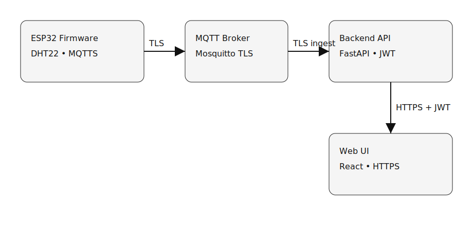
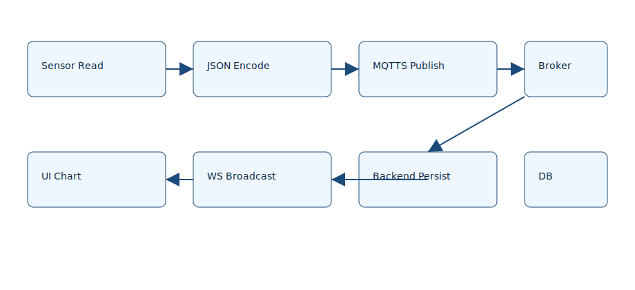
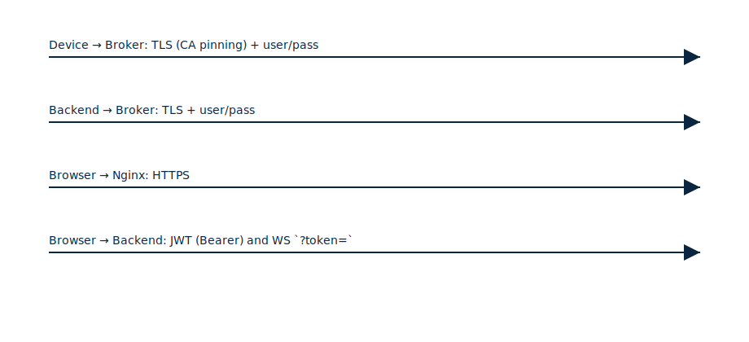

## README excerpt


```md
## CI/CD
- PRs → `ci.yml`: Ruff lint + pytest for backend, ESLint + typecheck + build for frontend, Docker build smoke.
- Tags `v*` or manual dispatch → `release.yml`: Pushes images to GHCR as `latest` and `<tag>` for amd64 and arm64.

---
## Diagrams




--- 
